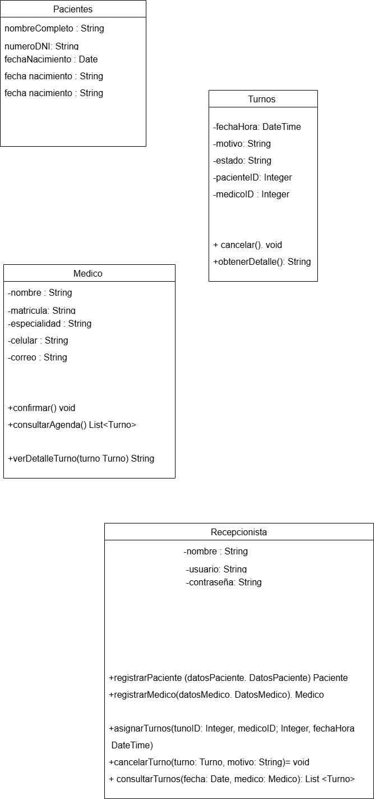

# Introduccion 

 - ¿Que es el Paradigma Orientado a Objetos?

 -  Es un paradigma de programación basado en el concepto de objetos, que son entidades que combinan datos 
    (atributos) y comportamientos (métodos). Este enfoque permite organizar el código de manera modular y 
    reutilizable, facilitando el desarrollo y mantenimiento de software.

# Fundamentos de la Programacion Orientada a Objetos 

 - Clase y Objetos : Son plantillas o moldes para crear objetos. Definen los atributos y métodos que tendrán los 
                    objetos.
 
 - Ejemplo : Piensa en una receta de pizza. La receta describe los ingredientes y los pasos para hacer una pizza, 
   pero no es una pizza real, sino solo un concepto.
   La receta es la clase.

    Cada pizza que cocinas usando la receta es un objeto basado en la clase "Receta de Pizza".

  - Objetos: Son instancias de una clase; cada objeto tiene su propio estado y comportamiento.

 
  - Encapsulamiento: Consiste en ocultar los detalles internos de un objeto y exponer solo lo necesario para su uso.
  El encapsulamiento oculta detalles internos y solo permite acceso a lo necesario.

  - Ejemplo:

     Un control remoto tiene botones para cambiar el canal y subir el volumen, pero no necesitas saber cómo funciona 
    internamente el circuito para usarlo.

  Los botones son la interfaz pública (lo que el usuario puede tocar).

  Los circuitos internos están ocultos dentro del control (no se pueden manipular directamente).

- Herencia: 
  Permite que una clase (subclase) herede atributos y métodos de otra clase (superclase), promoviendo la 
  reutilización del código.

La herencia permite que una entidad herede características de otra.

- Ejemplo:
   Imagina que tienes una bicicleta y una motocicleta.

    Ambas tienen ruedas, manubrio y frenos (atributos comunes).

    Pero la motocicleta tiene motor, mientras que la bicicleta no

  - Polimorfismo: Permite que un mismo método tenga diferentes comportamientos según el objeto que lo utilice.

    El polimorfismo permite que diferentes objetos respondan de manera diferente a una misma acción.

  - Ejemplo:

    Un músico toca diferentes instrumentos, pero cada uno suena distinto.

    Si le das una guitarra, tocará acordes.

    Si le das un piano, tocará notas.

    Si le das una batería, hará ritmos.

- Abstracción
  La abstracción oculta los detalles complejos y solo muestra lo esencial.

- Ejemplo:  

    Piensa en conducir un coche.

    Sabes que para arrancarlo solo giras la llave o presionas un botón.

    No necesitas conocer cómo funciona el motor internamente, la combustión, la transmisión, etc.

    La abstracción en POO funciona igual: te da herramientas sencillas sin mostrar la complejidad interna.

# Requisitos iniciales del sistema

- Registro de usuarios: El sistema debe permitir la creación y gestión de usuarios.

- Gestión de turnos: Los usuarios deben poder solicitar, cancelar y reprogramar turnos.

- Notificaciones: El sistema debe enviar recordatorios de turnos vía correo o mensaje.

- Historial de turnos: Se debe permitir consultar turnos pasados.

-Control de acceso:Solo usuarios registrados pueden acceder a ciertas funciones.

# Desarrollar cinco casos de uso con el formato
  adecuado:
  
  
## Consulta de turnos

-  Descripción:
   El paciente puede ver los turnos que tiene registrados, ya sea próximos o pasados.

-  Precondiciones:

   El paciente debe haber iniciado sesión.

- Postcondiciones:

   Se muestra la información de los turnos asociados al paciente.

## Solicitud de turno

- Descripción:
  El paciente accede al sistema para solicitar un turno con un médico en una fecha y hora disponibles según la 
  especialidad médica.

- Precondiciones:

  El paciente debe estar registrado e iniciar sesión en el sistema.

  Deben existir médicos disponibles con horarios habilitados.

- Postcondiciones:

  Se registra un nuevo turno en el sistema.

  El paciente recibe una confirmación del turno solicitado.

### Notificación de turnos

- Descripción:
  El sistema envía notificaciones automáticas a los pacientes para recordarles sus turnos próximos.

- Precondiciones:

  El paciente debe tener un turno registrado en el sistema.

  Debe haber un medio de contacto disponible (correo electrónico, SMS, etc.).

- Postcondiciones:

  El paciente es notificado del turno.

  Se registra que la notificación fue enviada.
 
### Modificar turno

- Descripción:

  El paciente puede cambiar la fecha u hora de un turno previamente solicitado, siempre que haya disponibilidad.

- Precondiciones:

  El paciente debe haber iniciado sesión.

  El turno debe estar activo y no haber pasado aún.

  Debe haber disponibilidad en el nuevo horario solicitado.

- Postcondiciones:

  Se actualiza la información del turno en el sistema.

  Se notifica al paciente del cambio realizado.

### Cancelar turno

- Descripción:

  El paciente puede cancelar un turno registrado en el sistema si no puede asistir.

- Precondiciones:

  El paciente debe haber iniciado sesión.

  El turno debe estar activo y no haber pasado aún.

- Postcondiciones:

  El turno es eliminado del sistema.

  El horario liberado queda disponible para otros pacientes.

# Boceto inicial del diseño de clases

 
